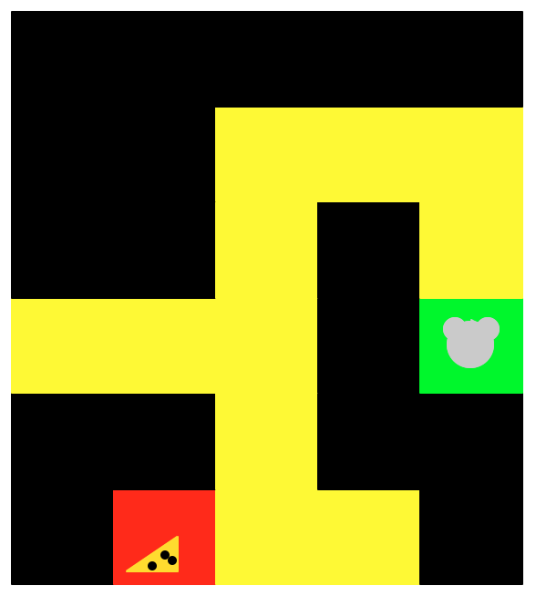
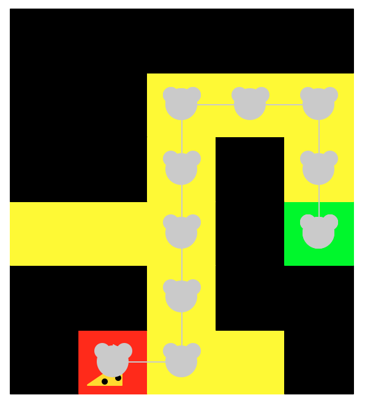

## CSCI 1133, Fall 2017 - Programming Examination 2

> **Due: 10:00 pm: Mon, NOV 13**

PLEASE NOTE: This is a graded assessment of individual programming understanding and ability, and is not a collaborative assignment; you must design, implement and test the solution(s) completely on your own without outside assistance from anyone except teaching staff. You may not consult or discuss the solution with anyone. In addition, you may not include solutions or portions of solutions obtained from any source other than those provided in class. Note that providing a solution or assisting another student in any way on this examination is also considered academic misconduct. Failure to heed these directives will result in a failing grade for the course and an incident report filed with the Office for Student Conduct and Academic Integrity for further sanction.</font>

>Read the requirements carefully, as it is your responsibility to have a clear understanding of what is being asked. If you do not understand, please ask teaching staff. Requirements for software are particularly difficult to express in English, thus it is likely that there will be subtleties that need clarification.


Clarifications to this document are marked with **[EDIT]**

<hr>

### A. Genetic Algorithm for Solving a Maze

A genetic algorithm approach to problem solving is a technique for intelligently searching through a (exponential) solution space. For this exam, you will create
a genetic algorithm approach for evolving a "mouse" to successfully navigate
a maze to find the "cheese." Maze test cases, visualization of the mouse moving through a maze, and the logic for the genetic algorithm has been provided for
you. Code for Monte Carlo selection has also been provided.

The total point value will be awarded for solutions that are complete, correct, and well constructed. A "well constructed" program entails good design, appropriate comments and general readability (descriptive names for variables and procedures, appropriate use of blank space, etc.). You MUST use classes in your
design. You MAY use dictionaries but this is not required.

Note that your work will be graded using the current version of Python 3 on CSE Labs UNIX machines, thus it must function correctly on that platform. If you complete this programming exam using a different system, it is your responsibility to ensure it works on CSELabs machines prior to submitting it. You can confirm this by cloning your repo into a new directory when logged in to a CSELabs machine and running the code from that directory.

#### Examination Repository

Examination files must be submitted to the GitHub using your "exam repository". Exam repositories have been created for each registered student and are named using the string exam- followed by your X500 userID (e.g., exam-smit1234). You must first clone your exam repository in your local home directory before submitting the materials for this exam. If you are having difficulty, consult the github from earlier in the semester. If your exam repository is missing or something is amiss, please contact the graduate TA.

_DO NOT SUBMIT YOUR EXAM FILES TO YOUR LAB/EXERCISE REPOSITORY!_

<hr>

#### Genetic Algorithm

##### Getting Started

Copy the code from the class repo in the exam02 folder on to your local
machine. You should not have to modify _maze_samples.py_ nor _maze.py_.

Please complete the assignment in the file _ga.py_. In that file, define a function _main()_ that:
- creates a genetic algorithm for one of the maze examples,
- evolves the population for a fixed number of generations or until a solution is found,
- visualizes the moves from the best individual using _maze.py_

> _main()_ should have few lines of code. It should make use of a class or
classes to solve the maze.

#### The Logic (also found in the file _ga_logic.py_)

##### GA in general

The framework of a genetic algorithm is based on the evolution of genes over generations. An individual is defined by some string meant to represent genes. The individual is tested in a given environment that results in a fitness value for that individual.

The GA begins with a population of individuals. For the next evolved generation, a new population is formed by selecting 2 parents (selection is biased to choose those more fit), and combine (i.e. cross breed) those 2 individuals by combining their genes to form a new individual. There is also a chance that the genes will undergo a mutation.

Populations are evolved over a number of generations (or until a solution is found) and the hope is that an individual will _converge_ on the solution.

To learn more about genetic algorithms, see
- https://courses.cs.washington.edu/courses/cse473/06sp/GeneticAlgDemo/
- https://www.tutorialspoint.com/genetic_algorithms/
- https://en.wikipedia.org/wiki/Genetic_algorithm


**The FILES**:
- maze.py : maze class that can visualize a given maze with series of moves
- maze_samples.py : 2 data structures to hold a maze and length of dna strand
- ga_logic.py : outlines the logic for GA and provides code for Monte Carlo selection
- ga.py : place your work in this file

**Constants and Maze Structure**:

- maze: a maze is a rowxcol grid. You start out where the mouse is and follow the moves. For example, if the mouse is at maze[3][4] and the move is up, then move the mouse up one row to maze[4][4]

This is a visualization of the initial state of a maze:

<p align="center">

</p>

- grid contents = ['x', '-', 'C', 'M'] which stands for: blocked, open, cheese, mouse (initial position)

- moves = ['U','D','R','L'] which stands for: up, down, right, left

This is a visualization of the final state of a solved maze:

<p align="center">

</p>

**Genetic Algorithm Logic**:
```
# In our version of the GA using the fitness function described below,
# A population size of 1000 that ran for a few generations converged
# - meaning found the cheese, for maze_sample[1]. For the other sample,
# the population did not converge after 1000 generations (with a high mutation rate).

  choose how many individuals to put in a population
  choose how many generations you want to evolve the population
  population = create a new population of individuals
  for g generations or until the solution is found:
    for p in population:
      calculate fitness of individual p
    new generation = []
    for p in size of population // 2:
      # See Code below for Monte Carlo Selection
      parent1 = select using monte carlo based on fitness
      parent2 = select using monte carlo based on fitness
      new_individual1, new_individual2 = cross-breed parent1 with parent2
      if mutate:
        randomly change 1 move in new individual
      add new individuals to new generation
```

**INDIVIDUAL / Mouse / Series of Moves**:
-  An individual is a string of moves (i.e. chromosome in GA vocab).
-  The string can be of length maze_samples.string_length[test_case]. It must be at least the length of the shortest path from mouse to cheese, but may be much longer.
-  For example, for maze_samples.maze[1], an individual has length 20.
-  Initialize the individual (mouse) with a series of moves:
    for example, a mouse dna might start out as 'UULDRDDLLLUURRD...'
-  The fitness of an individual is made up by the designer of the genetic algorithm and must have some relationship to the problem being solved.
-  A suggested fitness function for this problem is below.
-  You can use this fitness measure or make up your own.

**Fitness Function Logic**:
  - count how many of the moves are in open places on the maze. if cheese is found, set this to the string length.
  - count how many moves the mouse makes before being blocked or going off maze
  - after all moves, if the final position is at the cheese, add fitness points equivalent to the string length.
  - fitness is the sum of these 3 numbers
  - IF MOVE is not to open space, ignore the move
  - If you add fitness points based on how close the final position is to the cheese, this might improve convergence.

**Cross Breed Logic**:
- b = randomly select a break point in the dna strand
- make new individual based on parent1[0:b] + parent2[b:]
- make new individual based on parent2[0:b] + parent1[b:]


**Mutate Logic**
```
  if random number < mutate rate then mutate individual
  if mutate individual
    idx = randomly select a move in the string
    m = randomly select one of the 4 moves
    individual[idx] = m # this shows logic, not proper syntax
```

**Monte Carlo Selection**:

The idea behind Monte Carlo selection is to randomly select from a list but
use weights to bias the selection towards certain elements in a list. Think about
it in terms of a dart board target or a roulette wheel. There are certain
selections in either case that are more likely than others. You are more likely
to hit the outer ring of a target because it encompasses more area. If you bet
on "red" versus the number 23, you are more likely to win because there are several red numbers but only one "23." For our purposes, we will give higher weight to those
individuals with higher fitness. This code will take an array of values - you
would want to pass it an array of fitness values, then select one of those
values using weighted selection. The more fit an individual, the more likely
it will be selected for breeding to create the next generation.

```Python
def SetWeightsForMonteCarloSelection(values):
  # Take a list of values
  # Normalize using sum(values)
  # Transform each value to rounded integer
  # The greater this value, the more likely to be selected (a weighting)
  # Transform values to accumulated selection weights
  normalized_values = [int(v/sum(values)*100+.5) for v in values]
  accum = 0
  selection_weights = []
  for w in normalized_values:
    accum += w
    selection_weights.append(accum)
  return selection_weights

def MonteCarloSelection(selection_weights):
  selection = random.randint(0,selection_weights[-1])
  for i,w in enumerate(selection_weights):
    if selection <= w:
      return i

population_size = 12
L = [ 10, 8, 7, 7, 5, 4, 3, 2, 2, 1, 1, 0]
S = SetWeightsForMonteCarloSelection(L)
print(S)
for i in range(population_size//2):
  # Weighted random selection with replacement of parents
  p1 = MonteCarloSelection(S)
  p2 = MonteCarloSelection(S)
  print('Parents ',p1,' ',p2)
```

#### Assessment

This assignment will be assessed on the basis of its correctness and code quality. Correctness means that the implementation of the genetic algorithm is correct.

**Correct does not mean that the genetic algorithm is guaranteed to solve the maze. Your genetic algorithm implementation can be 100% correct and never solve the maze!**

The ability for a GA to solve a problem depends on the problem, how individuals are represented and evolved, and especially on the quality of the fitness function. You are not being assessed on the quality of the fitness function.

_Good_ code means that you appropriately decomposed the problem into data structures, classes, and functions. Classes, functions, and variables should have meaningful names. Comments are provided where appropriate.

<hr>

### Seeking Assistance

Unlike the last exam, you can seek assistance from teaching staff (any TA or Dr. Larson) in limited capacity.

#### Understanding the Problem

You may ask for clarification of the following concepts:

- The general framework of a GA
- Crossbreeding
- Mutation
- Populations
- Generating a new population
- Monte Carlo selection

You may ask questions about the functionality of:

- Code provided in _maze.py_
- Code provided in _maze_samples.py_
- Code provided in _ga.py_
- Code provided for Monte Carlo Selection

You may ask for assessment of your problem decomposition. Bring to the teaching staff your outline of class definitions, including its member variables and functions. Staff can make recommendations based on the quality of that decomposition.

You may ask for debugging advice regarding specific code, if you have the problem isolated. This means that you have spent time debugging the code, and you know which lines or which function is not working. Staff will not debug code for you, but they can offer strategies to better isolate and identify the problem.

You may ask generic questions about Python syntax and concepts. For example, you could discuss overloaded class functions, such as __lt__ and __gt__, the use of _enumerate_(), or the function _sorted_.

<hr>

#### Submission Instructions

Put all of your source code into the file `ga.py` that imports _maze.py_,
and _maze_samples.py_. Commit/push your source file to your exam repository prior to the deadline.

*PLEASE NOTE:* missing submissions will result in a grade of zero.
*NO LATE WORK ACCEPTED*

<u>It is HIGHLY recommended</u> that you regularly put your working version of your code in github, particularly if you are working on your personal machine. Laptops and PCs die all the time - and sometimes the night your assignment is due!! **PLEASE back-up your work regularly** - github is great for that. Google drive is probably the next best thing!
